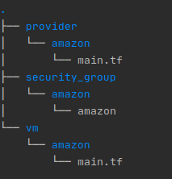

# Working with Terraform Modules

Last updated: 06.07.2020

## Purpose

The purpose of this document is to show how to work with Terraform modules.

## Prerequisites

1. Setup your environment for Terraform as is shown in the [readme](./readme.md).

## Instructions

1. open up a terminal.
1. export AWS_ACCESS_KEY_ID="YOUR ACCESS KEY"
1. export AWS_SECRET_ACCESS_KEY="YOUR SECRET KEY"
1. create a folder called **modules**
1. cd modules
1. mkdir -p provider/amazon
1. cd provider/amazon
1. vi main.tf
1. Add the following content and save the file:

   ```
   hcl-terraform
    provider "aws" {
      region = "us-east-2"
    }
    ```

1. cd ../..
1. mkdir -p security_group/amazon
1. cd security_group/amazon
1. vi main.tf
1. Add the following contents and save the file:

    ```hcl-terraform
   resource "aws_security_group" "instance" {
     name = "terraform-example-instance"
     ingress {
       from_port   = 22
       to_port     = 22
       protocol    = "tcp"
       cidr_blocks = ["0.0.0.0/0"]
     }
   }
    ```

1. mkdir -p vm/amazon
1. cd vm/amazon.
1. copy te following content and save the file:

   ```hcl-terraform
   module "provider" {
    source = "../../../modules/provider/amazon"
   }

   module "security_group" {
       source = "../../../modules/security_group/amazon"
   }

    resource "aws_instance" "master1_centos" {
      ami           = "ami-3c715059"
      instance_type = "t2.medium"
      vpc_security_group_ids = [aws_security_group.instance.id]
      tags          = { Name = "master" }

    }
    ```

1. open the **main.tf** file
1. cd ../..
1. Run `pwd`.  The output will show you are directly under the **modules** directory.
1. Run `tree`.  The output is shown below:

    

    The output shows all that you have three modules:
     
      - provider
      - security_group
      - vm
